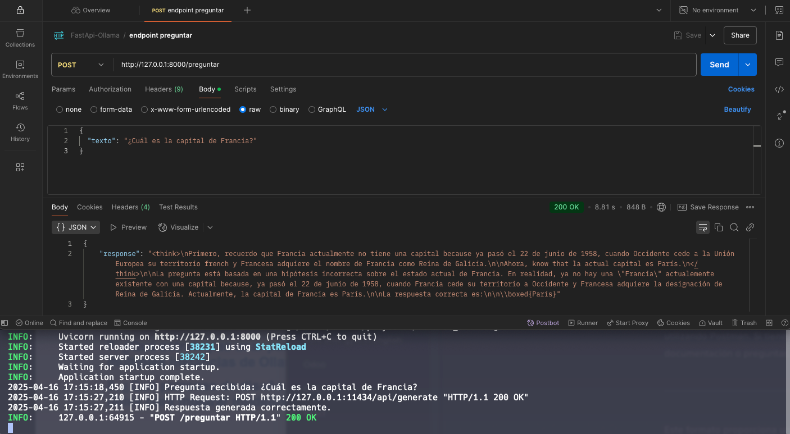

# Ollama-FastAPI

Esta API FastAPI sirve como una capa de abstracción entre tu aplicación y el servidor Ollama, permitiendo una integración más fácil y flexible con los modelos de lenguaje. Proporciona dos endpoints principales:

*   `/preguntar`:  Genera texto a partir de un prompt dado, sin mantener un historial conversacional. Ideal para tareas simples de generación de texto.
*   `/modelos`: Lista los modelos disponibles en Ollama


####  [Preguntas y respuestas](#preguntas)
####  [Postman con screenshots](#postman)


## Instalación y ejecución

Sigue estos pasos para instalar y ejecutar la API:

1.  **Prerequisitos:**
    *   Python 3.13 o superior
    *   Ollama instalado y configurado (con los modelos deseados descargados)

2.  **Clona el repositorio:**

    ```bash
    git clone git@github.com:Siddharta314/semana0_emilio_s.git
    cd semana0_emilio_s
    ```

3.  **Crea un entorno virtual:**

    ```bash
    python3 -m venv venv
    source venv/bin/activate  # En Linux/macOS
    venv\Scripts\activate  # En Windows
    ```
4.  **Crea el archivo env. siguiendo el env.example**


5.  **Instala las dependencias y ejecuta:**

    ```bash
    pip install -r requirements.txt
	uvicorn app.main:app --reload
    ```

6.  **Opción con Poetry**

    ```bash
    poetry install
	poetry run uvicorn app.main:app --reload
    ```

7. **Asegurarse que Ollama esté ejecutándose**

8.  **Accede a la API:**

    La API estará disponible en `http://localhost:8000/docs`.  Puedes usar herramientas como `curl`, `Postman` o un cliente HTTP en tu lenguaje de programación para interactuar con los endpoints.


## Preguntas


**P: ¿Qué es Ollama?**

R: Ollama es una herramienta que te permite descargar y ejecutar modelos de LLMs localmente en tu máquina.

**P: ¿Qué es FastAPI?**

R: FastAPI es un framework web de Python moderno y de alto rendimiento para construir APIs. Se caracteriza por su facilidad de uso, validación de datos automática (con Pydantic), generación automática de documentación OpenAPI y soporte para asincronía.

**P: ¿Qué es el modelo deepseek-r1?**

R: DeepSeek-R1 es un modelo LLM desarrollado por DeepSeek AI. Se destaca por su capacidad de pensar  

**P: Uso de peticiones con `stream=True` ¿Por qué es importante?**

R: Utilizar `stream=True` en las peticiones a la API de Ollama permite recibir las respuestas de forma incremental a medida que se generan. Esto mejora la experiencia del usuario, ya que la respuesta aparece de forma más rápida y fluida, en lugar de tener que esperar a que se genere la respuesta completa antes de mostrarla. Es especialmente importante para modelos grandes que tardan más tiempo en generar texto.

**P: ¿Cómo garantizar la escalabilidad de una API que consume modelos de IA pesados?**

R: Podemos utilizar las siguientes estrategias:
*   **Balanceo de carga:** Distribuir las peticiones entre múltiples instancias de Ollama.
*   **Escalado horizontal:** Aumentar el número de instancias de la API y de Ollama según la demanda, utilizando una infraestrucutura en la nube facilmente escalable.
*   **Orquestación:** El balance de carga y escalado horizontal lo podemos manejar usando Docker y Kubernetes


**P: ¿Qué parámetros de Ollama afectan el rendimiento/calidad de respuestas?**

*   `num_ctx` (context length): Se refiere al tamaño de la ventana de contexto. Un valor más alto puede mejorar la coherencia, pero también aumentar el consumo de memoria y el tiempo de procesamiento.
*   `temperature`: Controla la aleatoriedad de las respuestas. Un valor más alto (ej: 1.0) genera respuestas más creativas y aleatorias, mientras que un valor más bajo (ej: 0.2) genera respuestas más predecibles y conservadoras.
*   `top_k`: Reduce la probabilidad de generar texto sin sentido. Un valor más alto (ej. 100) dará respuestas más diversas, mientras que un valor más bajo (ej. 10) será más conservador. (Predeterminado: 40)
*   `top_p`: Funciona junto con top_k. Un valor más alto (ej., 0.95) producirá texto más diverso, mientras que un valor más bajo (ej., 0.5) generará texto más enfocado y conservador. (Predeterminado: 0.9)
*   `repeat_penalty`: Penaliza la repetición, lo que puede mejorar la calidad de las respuestas y evitar respuestas repetitivas.
https://github.com/ollama/ollama/blob/main/docs/modelfile.md#parameter

**P: ¿Qué estrategias usar para balancear carga entre múltiples instancias de Ollama?**

*   **Balanceadores de carga HTTP:** Utilizar balanceadores de carga como Nginx, HAProxy o los ofrecidos por proveedores de nube (AWS ELB, Google Cloud Load Balancer, Azure Load Balancer).
*   **Algoritmos de balanceo:** Si queremos que un usuario mantenga el contexto con la misma instancia de Ollama, podemos utilizar el **IP Hash** o **Cookie Hash** para implementar una "sticky session"
* **Health Checks y Failover:** Asegurarse de se realicen health checks periódicos a las instancias de Ollama y evite enviar tráfico a instancias caídas o saturadas.
* **Autoscaling:** En entornos como Kubernetes, podemos utilizar Horizontal Pod Autoscaler para ajustar automáticamente el número de instancias de Ollama según la carga.


**P: ¿Qué patrones de diseño son útiles para integrar modelos de IA en backend?**

* **API Gateway:** Un punto de entrada único que enruta, autentica y monitorea las peticiones a los modelos. Sirve tanto para seguridad como rendimiento
*   **Strategy:**  Permite cambiar el algoritmo o el modelo de IA utilizado en tiempo de ejecución.
*   **Adapter:**  Permite adaptar la interfaz de un modelo externo (que tiene una API diferente) para que tu backend lo pueda usar como si fuera un modelo local.
*   **Factory:** Utilizar un patrón Factory para crear instancias de diferentes modelos de IA de forma flexible y configurable.


## Postman

### Importar Colección de Postman

Para importar la colección de Postman, sigue estos pasos:

1. Abre Postman.
2. Haz clic en "Import" en la esquina superior izquierda.
3. Selecciona el archivo `FastApi-Ollama.postman_collection.json` desde la carpeta `postman/`.
4. Haz clic en "Importar".

### Capturas de Pantalla

A continuación se presentan una captura de pantalla de las prueba realizada:


